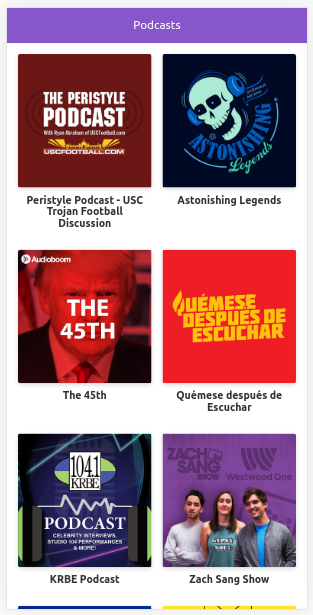

# App de Podcasts de Platzi

App de Podcasts integrada con la API de AudioBoom del curso de Next.js de Platzi

## ¿Cómo funciona?

Requiere Node.JS 10 o superior

* `npm install` para instalar las dependencias
* `npm run dev` para correr el entorno de desarrollo
* `npm run build && npm start` para compilar el bundle y correr el entorno de producción

## Licencia

MIT